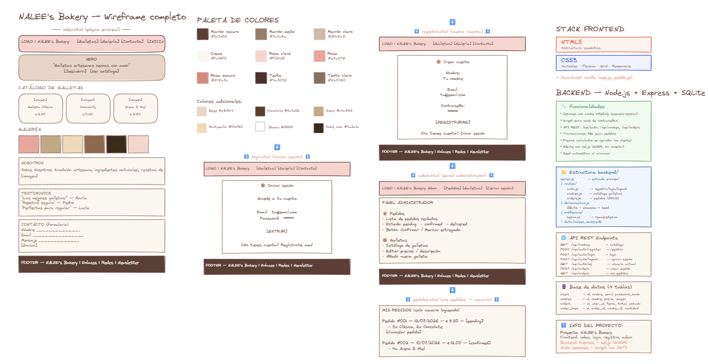

# NALEE's Bakery 🍪

Aplicación web de catálogo y pedidos de galletas artesanas, con frontend estático y backend propio.

## ✨ Funcionalidades

- **Catálogo de galletas** — 6 variedades artesanas con imágenes, descripción y precio
- **Selección de cantidades** — selector +/− con límite 0–99 por producto
- **Resumen de pedido** — cálculo en tiempo real de subtotal, descuento (10% si >10 unidades) y total
- **Registro e inicio de sesión** — modal en la misma página, sin recargar
- **Autenticación segura** — contraseñas cifradas con bcrypt, sesiones con cookie httpOnly
- **Pedidos persistentes** — creación y consulta de pedidos por usuario, con transacciones SQL
- **Internacionalización** — interfaz completa en español e inglés
- **Responsive** — diseño mobile-first adaptado a 375px, 768px y 1280px

## 🛠 Stack técnico

| Capa | Tecnología |
|------|-----------|
| Frontend | HTML5, CSS3 (variables, Flexbox, Grid), JavaScript vanilla |
| Tipografía | Playfair Display + Source Sans 3 (Google Fonts) |
| Backend | Node.js ≥18, Express |
| Base de datos | SQLite (via sql.js — WASM, sin compilación nativa) |
| Autenticación | bcryptjs + express-session (cookie httpOnly) |

## 📁 Estructura del proyecto

```
Nalee-s-Bakery/
├── public/                    # Frontend estático
│   ├── index.html             # Página principal (catálogo + modal login)
│   ├── login.html             # Login standalone
│   ├── registro.html          # Registro standalone
│   ├── style.css              # Estilos (tokens de diseño CSS)
│   ├── app.js                 # Lógica de auth, navegación y modal
│   ├── pedido.js              # Gestión de cantidades y pedidos
│   ├── i18n.js                # Selector de idioma ES/EN
│   ├── lang/translations.js   # Diccionario de traducciones
│   └── images/                # Imágenes del catálogo
│       ├── Galletas/          # 6 variedades
│       ├── Avatares/          # Fotos de testimonios
│       └── Nosotros/          # Imagen corporativa
├── backend/
│   ├── server.js              # Punto de entrada del servidor Express
│   ├── package.json
│   ├── .env / .env.example    # Configuración (BD, puerto, secret)
│   ├── db/connection.js       # Conexión SQLite + esquema + seed automático
│   ├── routes/
│   │   ├── auth.js            # POST /api/auth/register, /login, /logout, GET /me
│   │   ├── cookies.js         # GET /api/cookies (catálogo público)
│   │   └── orders.js          # GET/POST /api/orders (protegido)
│   └── middleware/
│       └── sesion.js          # requiereSesion / requiereSesionPagina
├── database/
│   ├── schema.sql             # Esquema MySQL (referencia histórica)
│   └── seed.sql               # Seed MySQL (referencia histórica)
├── spec/                      # Specification-Driven Development
│   ├── constitution/          # Misión, tech-stack, roadmap
│   └── features/              # 9 features con spec, plan y tareas
├── wireframe-new.excalidraw   # Wireframes de la interfaz
└── .agents/skills/            # Skills del proyecto
```

## 🚀 Instalación y uso

### Requisitos
- Node.js >= 18

### Pasos

```bash
# 1. Clonar el repositorio
git clone <url>
cd Nalee-s-Bakery

# 2. Instalar dependencias del backend
cd backend
npm install

# 3. (Opcional) Configurar variables de entorno
#    Editar backend/.env — la configuración por defecto funciona sin cambios

# 4. Iniciar el servidor
npm start
#    Servidor en http://localhost:3000

# 5. Abrir el navegador en http://localhost:3000
```

La base de datos SQLite se crea automáticamente en `backend/data/nalees_bakery.db` al arrancar el servidor, con el esquema de tablas y el catálogo de 6 galletas precargado.

## 🎨 Diseño

### Wireframes


El archivo [`wireframe-new.excalidraw`](wireframe-new.excalidraw) contiene los wireframes completos en formato editable. La vista previa incluye:

- **Página principal** (`index.html`): header con navegación, hero, galería de 6 productos, sección sobre nosotros, testimonios, ubicación con mapa, formulario de contacto y footer
- **Página de login** (`login.html`): targeta centrada con formulario de acceso
- **Paleta de colores**: 9 colores principales (marrones, rosas, crema) y 6 colores adicionales por variedad
- **Estructura backend**: diagrama de rutas, base de datos y middleware

### Tokens de diseño

| Token | Valor | Uso |
|-------|-------|-----|
| `--color-marron-oscuro` | `#5c3d35` | Textos principales, hover |
| `--color-marron-medio` | `#9a7a6a` | Bordes, textos secundarios |
| `--color-marron-claro` | `#d0b8a8` | Fondos, bordes suaves |
| `--color-crema` | `#faf6f0` | Fondo general de página |
| `--color-rosa-claro` | `#f7d4d0` | Header, secciones destacadas |
| `--color-rosa` | `#e8a598` | Botones, CTA, enlaces |
| `--color-rosa-oscuro` | `#d48a7a` | Hover de botones |
| `--color-texto` | `#4a3030` | Texto general |
| `--color-texto-claro` | `#8a7060` | Texto secundario, pies |

## 📡 API REST

| Método | Ruta | Auth | Descripción |
|--------|------|------|-------------|
| GET | `/api/cookies` | No | Catálogo de galletas |
| POST | `/api/auth/register` | No | Registro de usuario |
| POST | `/api/auth/login` | No | Inicio de sesión |
| POST | `/api/auth/logout` | Sí | Cierre de sesión |
| GET | `/api/auth/me` | Sí | Datos del usuario actual |
| GET | `/api/orders` | Sí | Pedidos del usuario |
| POST | `/api/orders` | Sí | Crear pedido |
| GET | `/health` | No | Estado del servidor y BD |

## 📄 Licencia

Proyecto educativo — Eines IA per al Desenvolupament de Programari (M2).
